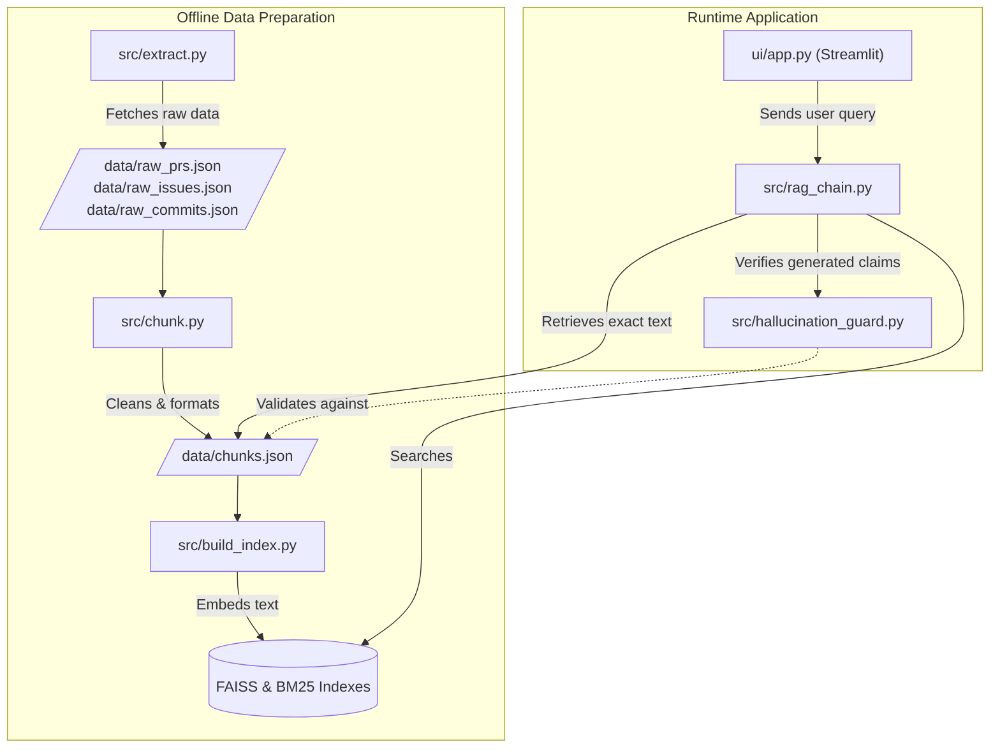

# PatchContext: System Documentation

## 1. Project Overview & The Problem We Are Solving

### The "What vs. Why" Trap in Software Engineering
Traditional software documentation effectively explains *what* a framework does and how to use it. The source code itself explains *how* it works. However, neither reliably explains **why** a specific design decision was made. 

When developers need to understand the architectural rationale, historical context, or alternative paths considered during the development of a framework like FastAPI, they have to manually hunt through scattered commit messages, pull request descriptions, code review comments, and issue threads. 

### The Solution: PatchContext
PatchContext is a specialized Retrieval-Augmented Generation (RAG) system built to answer **"Why was this designed this way?"** questions about the FastAPI repository. 

Instead of generating generic summaries of what a feature is, PatchContext grounds every answer in the actual historical context of the repository. It forces the language model to extract facts directly from the people who built the framework, provides clickable citations for every claim, and uses a secondary AI model (an NLI hallucination guard) to mathematically verify that the LLM is not inventing history.

---

## 2. System Pipeline

PatchContext operates in a multi-phase pipeline, separated into data preparation (offline) and query execution (runtime).

### Phase 1: Data Preparation (Offline)
1. **Extraction (`extract.py`)**: Connects to the GitHub API to download historical Issues, Pull Requests, and Commits from the `fastapi/fastapi` repository, saving them as raw JSON.
2. **Chunking (`chunk.py`)**: Cleans the raw JSON. It drops low-signal content (like "+1" comments or bot messages), formats threads into readable conversational text, and chunks them to fit into embedding context windows.
3. **Indexing (`build_index.py`)**: Embeds the text chunks into mathematical vectors and builds a local FAISS index for dense semantic search, alongside a BM25 index for exact-keyword search.

### Phase 2: Query Execution (Runtime)
1. **Positional Routing**: Before searching vectors, the system checks if the user is asking a meta-query (e.g., "What was the first commit?"). If so, it bypasses the AI and uses a deterministic metadata lookup for speed and 100% accuracy.
2. **Hybrid Retrieval**: The user's question is embedded and searched against the FAISS and BM25 indexes using an Ensemble Retriever with Maximal Marginal Relevance (MMR). This ensures retrieved documents are both highly relevant and diverse.
3. **Strict Generation**: The retrieved chunks are injected into a highly constrained prompt. The LLM is instructed to answer *strictly* using the provided text, to refuse if the text doesn't contain the rationale, and to cite every single sentence with a strict bracket format (e.g., `[PR#123]`).
4. **Hallucination Verification**: The generated answer is parsed sentence-by-sentence. The NLI Hallucination Guard looks up the exact chunk cited by a sentence and scores the logical entailment. If the cited source doesn't support the claim, it is flagged.
5. **UI Rendering**: The Streamlit interface displays the answer, resolves the citations into clickable GitHub links, and presents a breakdown of the verification scores.

---

## 3. Data Storage & Database Architecture

PatchContext does not rely on a traditional relational (SQL) or NoSQL database server. Instead, it uses a lightweight, highly portable **local file-based architecture** stored entirely within the `data/` directory.

### 1. Raw Storage Layer
The data scraped from GitHub is saved directly as flat JSON files:
- `data/raw_prs.json`, `data/raw_issues.json`, `data/raw_commits.json`
- This acts as the cold storage / source-of-truth, allowing the index to be rebuilt with different parameters without needing to re-ping the GitHub API.

### 2. Processed Chunk Layer
- `data/chunks.json`: This acts as a NoSQL-like document store. It holds the cleaned, formatted narrative chunks along with rich metadata (Author, URL, Date, Labels, ID). The system performs direct memory lookups against this file during citation resolution and positional routing.

### 3. Vector & Sparse Databases (The Retrieval Layer)
For search, the system builds two specialized, serverless databases:
- **FAISS Database (`data/faiss_index/`)**: This acts as the vector database. It stores the 384-dimensional dense embeddings created by the HuggingFace model. FAISS allows for lightning-fast semantic similarity searches entirely in CPU memory.
- **BM25 Database (`data/bm25_index.pkl`)**: This acts as a sparse, exact-keyword database (similar in concept to Elasticsearch). It is stored as a serialized Python pickle file and is loaded into memory to catch specific terms that dense vectors might miss (like "HTTPException").

---

## 4. Models and Specifications

PatchContext uses a heterogeneous mix of models, routing specific tasks to the architectures best suited for them to balance speed, cost, and accuracy.

| Component | Model | Hosting | Purpose & Specifications |
| :--- | :--- | :--- | :--- |
| **Generation (LLM)** | `llama-3.3-70b-versatile` | Cloud (Groq API) | **Specs:** 70 Billion parameters, high instruction-following capability. **Role:** Synthesizes historical context and strictly adheres to formatting and refusal constraints. We run this at `Temperature = 0` to ensure deterministic, highly factual, non-creative outputs. |
| **Embedding** | `all-MiniLM-L6-v2` | Local (CPU) | **Specs:** 384-dimensional dense vectors, lightweight. **Role:** Maps the historical GitHub data and user queries into a vector space for semantic similarity search. Runs instantly on standard CPUs. |
| **Hallucination Guard** | `cross-encoder/nli-deberta-v3-base` | Local (CPU) | **Specs:** 86M parameter cross-encoder optimized for Natural Language Inference (NLI). **Role:** Evaluates (Premise, Hypothesis) pairs. It reads the source text and the LLM's claim, outputting a score for Entailment, Neutrality, or Contradiction to catch hallucinations. Threshold is set to `0.35` for Entailment. |

---

## 5. File Structure and Execution Guide

The project is structured into modular scripts. The overall execution flow is divided into offline data preparation and runtime application.

To run the system from scratch, execute the following files in order from the `patchcontext/` directory:

### Backend Scripts (`src/`)

1. **`src/config.py`**
   - **Role**: The central nervous system of the project. Contains all constants, API model names, thresholds, blocklists, and file paths. 
   - **Key Code Concept**: Centralizes variables like `LLM_MODEL = "llama-3.3-70b-versatile"` and knowledge bounds like `CORPUS_NEWEST_DATE`, which are injected dynamically into LLM prompts so the model knows its own chronological limits.
   - **Execution**: Not executed directly. Imported by all other scripts.

2. **`src/extract.py`**
   - **Role**: Authenticates with GitHub (using `.env`) and paginates through the repository to download raw history.
   - **Key Code Concept**: Uses the `requests` library with `Authorization: Bearer` to fetch paginated GitHub API endpoints for issues, PRs, and commits, gracefully handling rate limits.
   - **Execution**: `python src/extract.py`

3. **`src/chunk.py`**
   - **Role**: Parses `raw_*.json` files. Applies cleaning regexes (stripping HTML comments, filtering out bots/spam) and outputs `data/chunks.json`.
   - **Key Code Concept**: Implements custom chunking logic (`_process_thread()`) that groups PR/Issue titles with their descriptive bodies and subsequent human comments into a cohesive, readable narrative block.
   - **Execution**: `python src/chunk.py`

4. **`src/build_index.py`**
   - **Role**: Loads `chunks.json`, runs the text through `all-MiniLM-L6-v2`, and saves the resulting FAISS and BM25 indexes to disk.
   - **Key Code Concept**: Uses LangChain's `FAISS.from_documents()` alongside `BM25Retriever.from_documents()` to dual-index the corpus for hybrid search.
   - **Execution**: `python src/build_index.py`

5. **`src/rag_chain.py`**
   - **Role**: Contains the core `PatchContextRAG` class. Handles positional routing, LangChain ensemble retrieval, and LLM generation. 
   - **Key Code Concept**: The `query()` method intercepts positional meta-questions via regex (`POSITIONAL_QUERY_PATTERNS`). Standard queries use an `EnsembleRetriever(weights=[0.4, 0.6])` to fetch chunks, which are passed to an extensively constrained prompt enforcing the "What vs. Why" trap guard.
   - **Execution**: `python src/rag_chain.py "Why use Depends()?"`

6. **`src/hallucination_guard.py`**
   - **Role**: Contains the `HallucinationGuard` class. Splits LLM outputs into sentences, strips citations, and runs the DeBERTa-v3 NLI model to verify claims.
   - **Key Code Concept**: Extracts citations via regex, matches them back to the exact retrieved chunks, and scores `(chunk_text, hypothesis)` pairs using `CrossEncoder.predict()`. Returns verification statuses (`VERIFIED`, `FLAGGED_CONTRADICTION`) based on the `NLI_THRESHOLD`.
   - **Execution**: `python src/hallucination_guard.py "Some generated text"`

### Frontend (`ui/`)

7. **`ui/app.py`**
   - **Role**: The Streamlit web application. It stitches together the RAG chain and the Hallucination guard into a responsive, premium user interface. 
   - **Key Code Concept**: Uses `@st.cache_resource` for RAG and Guard initializations to keep massive ML models in memory across user interactions. Manages custom CSS injection and dynamic markdown parsing (`_format_answer_html`) for citation links.
   - **Execution**: `streamlit run ui/app.py`

---

## 6. Dependencies and Libraries

PatchContext relies on the following core libraries and specific versions (as defined in `requirements.txt`):

- **LangChain Ecosystem**: 
  - `langchain>=0.3,<0.4` and `langchain-community>=0.3,<0.4` for vector store wrappers, retrievers, and RAG pipelines.
  - `langchain-groq>=0.2,<0.3` for connecting to the Groq API for LLaMA 70B generation.
- **Vector Search & ML**:
  - `faiss-cpu>=1.7` for dense semantic vector similarity search.
  - `rank_bm25` for sparse, exact-keyword retrieval.
  - `sentence-transformers>=3.0` for local embedding (`all-MiniLM`) and Cross-Encoder NLI execution (`deberta-v3`).
  - `torch`, `numpy`, and `pandas` for tensor operations beneath the Transformers library.
- **Web Interface**:
  - `streamlit>=1.30` for the frontend UI architecture and reactive caching.
- **Utilities**:
  - `requests>=2.31` for GitHub API interactions.
  - `python-dotenv` for local environment variable management.

---

## 7. User Interface & Example Outputs

The UI is built with Streamlit but heavily customized with CSS to provide a premium, modern experience.

### Key UI Features:
- **Hero Header**: A clean, descriptive landing section explaining the system's purpose.
- **Answer Card**: The LLM's response is presented with highlight colors for citation tags. All valid citations are automatically converted into clickable `[tag]` links pointing directly to the original GitHub PR/Issue/Commit.
- **Per-Claim Verification Badges**: A visual breakdown of the NLI guard's results:
  - ✅ **Verified**: The LLM's claim is mathematically supported by the cited source.
  - ⚠️ **Unsupported**: The LLM's claim is neutral or missing from the cited source.
  - ❌ **Contradiction**: The cited source actively contradicts the LLM's claim.
  - ❓ **Unverified**: The LLM forgot to cite the claim, or the system used Positional Routing (direct metadata lookup without LLM generation).
- **Source Expander**: A dropdown view of all chunks retrieved by the dense search, including author names, dates, relevance scores, and text previews.

### Example Interaction:
**User Question**: *"Why does FastAPI use Depends()?"*

**System Response**:
1. **Retrieves**: PR #10719, Issue #260, etc.
2. **Generates**: *"FastAPI uses `Depends()` to allow for modular dependency injection that can be shared across multiple routes [issue#260]."*
3. **Verifies**: The NLI model reads Issue #260, reads the generated sentence, scores Entailment at `0.85`, and marks it ✅ **Verified**.
4. **Displays**: The user sees the answer with a green verification badge and can click `[issue#260]` to read the original discussion.
