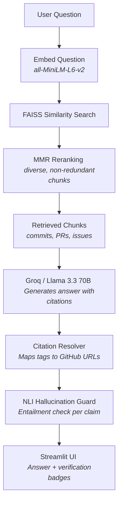

# PatchContext

A Retrieval-Augmented Generation (RAG) system that answers **"why was this designed this way?"** questions about the [FastAPI](https://github.com/fastapi/fastapi) repository, grounding every answer in real commits, pull requests, and issue discussions — with clickable citations and an automated hallucination check.

## Problem

Documentation explains *what* a framework does. Source code explains *how* it works. Neither reliably explains **why** — that reasoning lives scattered across commit messages, PR descriptions, review comments, and issue threads. PatchContext makes that scattered reasoning queryable.

## Architecture



## Repository Layout

```
patchcontext/
├── README.md
├── requirements.txt
├── .env.example
├── data/
│   ├── raw_prs.json              # from extract.py
│   ├── raw_issues.json           # from extract.py
│   ├── raw_commits.json          # from extract.py
│   ├── chunks.json               # from chunk.py
│   ├── faiss_index/              # from build_index.py
│   ├── benchmark_questions_template.json
│   ├── benchmark_questions.json  # filled-in template
│   └── eval_results.json         # from evaluate.py
├── src/
│   ├── config.py
│   ├── extract.py
│   ├── chunk.py
│   ├── build_index.py
│   ├── rag_chain.py
│   ├── hallucination_guard.py
│   ├── benchmark_helper.py
│   └── evaluate.py
└── ui/
    └── app.py
```

## Setup

### Prerequisites

- Python 3.10+
- A GitHub Personal Access Token ([create one here](https://github.com/settings/tokens) — no scopes needed for public repos)
- A Groq API key

### Installation

```bash
cd patchcontext
pip install -r requirements.txt
```

### Environment Variables

Copy `.env.example` to `.env` and fill in your keys:

```bash
cp .env.example .env
# Edit .env with your GITHUB_TOKEN and GROQ_API_KEY
```

Or export directly:

```bash
export GITHUB_TOKEN="ghp_xxx"
export GROQ_API_KEY="gsk_xxx"
```

### Secure deployment

For hosted deployments, keep the keys in your platform's secret manager instead of committing them to git. The app will read values from environment variables or Streamlit secrets automatically.

- Streamlit Cloud: set the keys in the app's Secrets panel.
- GitHub Actions / other CI: store them as repository or environment secrets.
- Local development: copy [.env.example](.env.example) to .env and fill in the values.

## Data Pipeline & File Execution Flow

```mermaid
flowchart LR
    A[extract.py] -->|raw json| B[chunk.py]
    B -->|chunks.json| C[build_index.py]
    C -->|FAISS Index| D[rag_chain.py]
    D -->|Context & Generation| E[hallucination_guard.py]
    E -->|Verified Outputs| F[ui/app.py]
    
    style A fill:#f9f,stroke:#333
    style B fill:#bbf,stroke:#333
    style C fill:#dfd,stroke:#333
    style D fill:#fdd,stroke:#333
    style E fill:#dff,stroke:#333
    style F fill:#ffd,stroke:#333
```



## Run Order

Execute each phase in sequence from the `src/` directory:

```bash
cd src

# Phase 1 — Pull PRs, issues, commits from GitHub (~10-25 min)
python extract.py

# Phase 2 — Clean + chunk, prints source-type breakdown
python chunk.py

# Phase 3 — Embed chunks + build FAISS index
python build_index.py

# Phase 4 — Sanity check: RAG chain
python rag_chain.py "Why does FastAPI use Depends() for dependency injection?"

# Phase 5 — Sanity check: with hallucination verification
python hallucination_guard.py "Why does FastAPI use Depends() for dependency injection?"

# Phase 6 — Build benchmark and run RAGAs evaluation
python benchmark_helper.py "Why does FastAPI use Depends()?"
# (fill in data/benchmark_questions.json from the template)
python evaluate.py --full

# Phase 7 — Launch UI
cd ..
streamlit run ui/app.py
```

## Known Limitations

- **Scoped corpus**: Indexes ~400 recent merged PRs + linked issues + ~500 standalone commits (not the full 7,000+ commit history). This is a deliberate precision-over-recall tradeoff to keep embedding cost/time bounded. Full-corpus indexing is future work.
- **No GitHub Discussions**: Only Issues, PRs, and Commits are ingested. Discussions are a known gap.
- **Rate limits**: `extract.py` handles 403/429 with sleep-and-retry, but ingestion is throttled to ~5,000 requests/hour (authenticated).
- **Cost**: Embedding + generation over the benchmark costs a few dollars total.
- **NLI model size**: First run downloads `cross-encoder/nli-deberta-v3-small` (~500 MB) from HuggingFace. Do this once before any live demo.

## Evaluation

The system is evaluated using [RAGAs](https://docs.ragas.io/) on a hand-built benchmark of design-rationale questions:

| Metric | What it measures | Pipeline stage |
|---|---|---|
| Faithfulness | Is the answer supported by retrieved context? | Generation + Guard |
| Answer Relevancy | Does the answer address the question? | Generation |
| Context Precision | Are retrieved chunks relevant? | Retrieval |
| Context Recall | Did retrieval surface what was needed? | Retrieval |

Results are reported with and without MMR to demonstrate the tradeoff between pure relevance and context diversity.
